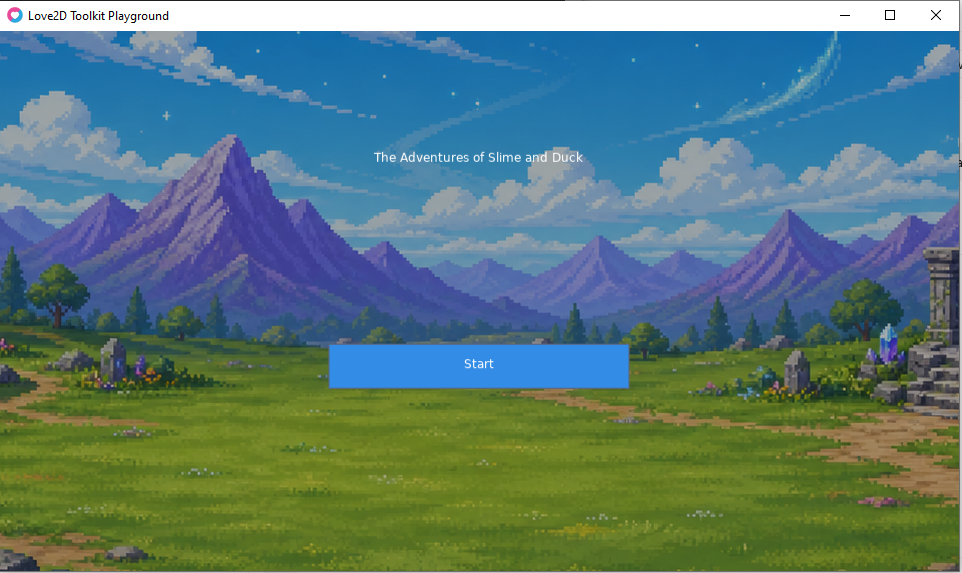

# Love2D Toolkit

A small Love2D template for building 2.5D games with an AI coding agent.

It includes:

- A reusable game foundation.
- Asset Lab for images, animations, and audio.
- A cutscene engine.
- Debugging and QA helpers.

The duck, slime, background, bomb, music, and cutscene are examples.

## Requirements

- Git
- Love2D 11.5 or newer
- Python 3.11 or newer for Asset Lab and QA helpers
- `love` for running the game; `lovec` is optional
- Provider API keys only when using external asset or audio services

## Boot

```cmd
git clone https://github.com/Razlif/love2d-toolkit.git
cd love2d-toolkit
love .
```

Love2D is enough to run the game. Python is only needed for Asset Lab and QA
helpers.

Linux/macOS users can install Python dependencies with:

```bash
python3 -m venv .venv
source .venv/bin/activate
python3 -m pip install -r asset_lab/requirements.txt
```

Windows users can use `python` and activate the virtual environment with
`.venv\Scripts\activate`.

Press **Start** on the title screen to try the example game and cutscene.



After booting, ask the agent:

> Read the repository and root documentation. Explain how this toolkit is organized.

The agent can then use Asset Lab to create and preview assets, promote selected
assets into `media_assets/`, build game states and levels, and create validated
cutscenes from the same runtime systems.

## Typical Agent Workflow

1. Set up the repository and ask the agent to read the code, root docs, and
   game lore.

2. Open Asset Lab. Ask the agent to create characters, props, backgrounds,
   effects, animations, and audio.

3. Preview the results in Asset Lab. Iterate with the agent until the assets
   are right.

4. Ask the agent to promote the selected assets into the game.

5. Ask the agent to build game states, levels, interactions, and systems around
   those assets.

6. Ask the agent to create cutscenes and connect them to the game.

7. Run the game, tests, and debug views. Continue iterating with the agent.

## Built-In Systems

- **State manager:** switches between title, playground, pause, and cutscene states.
- **Asset loader:** loads promoted runtime assets from the generated manifest.
- **Animation manager:** plays sprite-sheet animations using `dt`.
- **Input manager:** provides named keyboard and mouse actions to controllers and UI.
- **Movement manager:** applies controller intent to entities.
- **Position manager:** handles 2.5D `x`, `ground_y`, and `z` positions.
- **Draw order:** sorts world entities by layer and ground position.
- **Masks and sensors:** create cached masks and report overlap events.
- **Camera and parallax:** follow entities, scroll the world, and support layered backgrounds.
- **Audio and timers:** handle music, sound effects, cooldowns, and timed events.
- **UI:** provides the title screen, pause overlay, dialogue cards, buttons, menus, and theme.
- **Save manager:** provides versioned local JSON saves; no save menu is connected yet.
- **QA telemetry:** records stable events, snapshots, results, and screenshots for QA runs.
- **QA bridge:** lets a local agent inspect a running game and submit normal input commands.

Collision is report-only. The game decides what an overlap should do. The
Love2D physics engine is not part of the current template.

## Love2D API Reference

The repository includes a searchable offline Love2D 11.5 API reference for
agents. Use it when the behavior or signature of a Love2D function is unclear:

```cmd
python dev_tools/love_docs/love_docs.py search camera
python dev_tools/love_docs/love_docs.py lookup love.graphics.captureScreenshot
```

See [dev_tools/love_docs/README.md](dev_tools/love_docs/README.md).

## Debug Mode

Launch the game with:

```bash
love . --debug
```

This enables the debug overlay and all debug categories. Use focused flags
when needed:

```bash
love . --debug-input --debug-camera --debug-state
love . --debug-entities --debug-masks --debug-sensors --debug-collisions
```

Debug mode shows positions, input, camera state, entities, masks, sensors, and
collision reports. It does not add physics or change collision responses.

For persistent collaborative QA:

```bash
python qa/run_game.py start
python qa/run_game.py bridge start
python qa/run_game.py bridge status
```

The bridge is localhost-only and token-protected. Its port and token are in the
active run's `qa/runtime_logs/<run_id>/bridge.json`.

## Asset Lab

Open `asset_lab/index.html` in a browser.


Asset Lab displays:

- Characters, props, backgrounds, and effects.
- Image versions and sprite sheets.
- GIF animation previews.
- The last-created asset after refresh.
- Audio candidates with preview, source, license, and attribution data.

### Providers And `.env`

Asset Lab supports:

- `self`: the agent creates files and saves them at the requested paths.
- `mock`: local testing without an external service.
- `pixellab`: generated images and animations through PixelLab.
- `autosprite`: AutoSprite provider workflow.
- Audio search: open-source and curated sound sources such as Freesound and
  OpenGameArt.

Create the environment file from the template:

```cmd
copy .env.example .env
```

On Linux/macOS:

```bash
cp .env.example .env
```

Add only the keys for the providers you use:

```text
PIXELLAB_API_KEY=...
AUTOSPRITE_API_KEY=...
FREESOUND_API_KEY=...
```

The `self` and `mock` providers do not need API keys. `.env` is ignored by
Git.

Ask:

> Read `asset_lab/manifest.json`, validate Asset Lab, and explain what is available.

The agent can then create, inspect, and promote assets using the helpers:

```cmd
python asset_lab/helpers/validate_lab_assets.py
python asset_lab/helpers/create_lab_asset.py --help
python asset_lab/helpers/promote_lab_asset.py --help
python asset_lab/helpers/audio_search.py --help
python asset_lab/helpers/promote_audio_asset.py --help
```

Linux/macOS users can use `python3` instead of `python`.

The agent should read the manifest first and never guess asset paths.

See [ASSET_LAB_GUIDE.md](ASSET_LAB_GUIDE.md) and
[AUDIO_WORKFLOW.md](AUDIO_WORKFLOW.md).

## Cutscene Engine

Cutscenes are declarative Lua scenes in `cutscene_engine/scenes/`.

Ask the agent to edit a scene, validate it, and preview it:

```cmd
python cutscene_engine/tools/validate_scene.py duck_slime_date
love . --cutscene duck_slime_date
love qa/love_checks
```

Use `python3` on Linux/macOS. If Love2D is not on `PATH`, set
`LOVE_EXECUTABLE` to its full path before running the Python QA tests. Some
Linux distributions also require SDL/OpenAL packages for Love2D audio.

The engine reuses game actors, animation, movement, camera, dialogue, effects,
music, and sound.

See [CUTSCENE_ENGINE_GUIDE.md](CUTSCENE_ENGINE_GUIDE.md).

## Game Design

Use `game_lore/` for story, characters, world rules, and design context.

Ask the agent to read the lore before changing game behavior or writing scenes.

## Current Status

- **AutoSprite:** account preparation exists; generation and animation are not implemented.
- **Save system:** the module exists; no save/load menu is connected yet.
- **Levels:** the playground example is active; no generic level loader or editor yet.
- **Game states:** title, playground, pause, and cutscene are wired; many other states are placeholders.
- **UI:** title menu, pause, dialogue, and theme work; settings, inventory, and other screens are placeholders.
- **Collision:** masks and sensors report overlaps; there is no physics or automatic response.
- **Parallax:** the system exists; the example uses basic background configuration.
- **Dev tools:** the offline Love2D 11.5 API reference is implemented; export and packaging tools are not implemented.
- **QA and testing:** core systems, runtime assets, Asset Lab, and cutscene validation checks are included.
- **Live QA bridge:** a local token-protected bridge can let an agent inspect a running game and send normal QA input commands.

## Supported Cutscene Commands

`wait`, `move`, `face`, `play_animation`, `say`, `camera_move`,
`camera_follow`, `camera_shake`, `play_effect`, `fade`, `play_sound`,
`play_music`, `stop_music`

## More Docs

- [LOVE2D_TEMPLATE_TUTORIAL.md](LOVE2D_TEMPLATE_TUTORIAL.md)
- [ASSET_LAB_GUIDE.md](ASSET_LAB_GUIDE.md)
- [AUDIO_WORKFLOW.md](AUDIO_WORKFLOW.md)
- [CUTSCENE_ENGINE_GUIDE.md](CUTSCENE_ENGINE_GUIDE.md)
- [TESTING_AND_DEBUGGING.md](TESTING_AND_DEBUGGING.md)
- [AGENTS.md](AGENTS.md)
