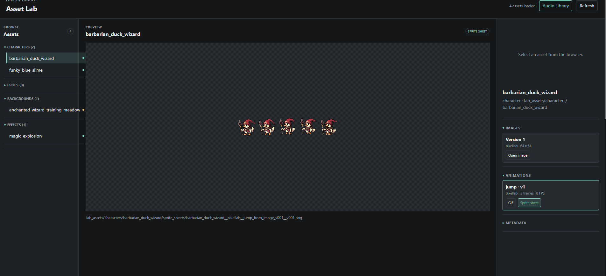

# Love2D Toolkit

A small Love2D template for building 2.5D games with an AI coding agent.

It includes:

- A reusable game foundation.
- Asset Lab for images, animations, and audio.
- A cutscene engine.
- Debugging and QA helpers.

The duck, slime, background, bomb, music, and cutscene are examples.

## Requirements

- Git
- Love2D 11.5 or newer
- Python 3.11 or newer
- `lovec` for command-line previews and QA, if available
- Provider API keys only when using external asset or audio services

## Boot

```cmd
git clone https://github.com/Razlif/love2d-toolkit.git
cd love2d-toolkit
love .
```

Press **Start** on the title screen to try the example game and cutscene.

## Start With The Agent

Ask:

> Read the repository and root documentation. Explain how this toolkit is organized.

If Graphify is installed and `graphify-out/graph.json` exists, the agent can
use it for local context. Graphify is optional.

## Typical Agent Workflow

1. Set up the repository and ask the agent to read the code, root docs, and
   game lore.

2. Open Asset Lab. Ask the agent to create characters, props, backgrounds,
   effects, animations, and audio.

3. Preview the results in Asset Lab. Iterate with the agent until the assets
   are right.

4. Ask the agent to promote the selected assets into the game.

5. Ask the agent to build game states, levels, interactions, and systems around
   those assets.

6. Ask the agent to create cutscenes and connect them to the game.

7. Run the game, tests, and debug views. Continue iterating with the agent.

## Asset Lab

Open `asset_lab/index.html` in a browser.



Asset Lab displays:

- Characters, props, backgrounds, and effects.
- Image versions and sprite sheets.
- GIF animation previews.
- The last-created asset after refresh.
- Audio candidates with preview, source, license, and attribution data.

### Providers And `.env`

Asset Lab supports:

- `self`: the agent creates files and saves them at the requested paths.
- `mock`: local testing without an external service.
- `pixellab`: generated images and animations through PixelLab.
- `autosprite`: AutoSprite provider workflow.
- Audio search: open-source and curated sound sources such as Freesound and
  OpenGameArt.

Create the environment file from the template:

```cmd
copy .env.example .env
```

Add only the keys for the providers you use:

```text
PIXELLAB_API_KEY=...
AUTOSPRITE_API_KEY=...
FREESOUND_API_KEY=...
```

The `self` and `mock` providers do not need API keys. `.env` is ignored by
Git.

Ask:

> Read `asset_lab/manifest.json`, validate Asset Lab, and explain what is available.

The agent can then create, inspect, and promote assets using the helpers:

```cmd
python asset_lab/helpers/validate_lab_assets.py
python asset_lab/helpers/create_lab_asset.py --help
python asset_lab/helpers/promote_lab_asset.py --help
python asset_lab/helpers/audio_search.py --help
python asset_lab/helpers/promote_audio_asset.py --help
```

The agent should read the manifest first and never guess asset paths.

See [ASSET_LAB_GUIDE.md](ASSET_LAB_GUIDE.md) and
[AUDIO_WORKFLOW.md](AUDIO_WORKFLOW.md).

## Cutscene Engine

Cutscenes are declarative Lua scenes in `cutscene_engine/scenes/`.

Ask the agent to edit a scene, validate it, and preview it:

```cmd
python cutscene_engine/tools/validate_scene.py duck_slime_date
lovec . --cutscene duck_slime_date
```

The engine reuses game actors, animation, movement, camera, dialogue, effects,
music, and sound.

See [CUTSCENE_ENGINE_GUIDE.md](CUTSCENE_ENGINE_GUIDE.md).

## Game Design

Use `game_lore/` for story, characters, world rules, and design context.

Ask the agent to read the lore before changing game behavior or writing scenes.

## Supported Cutscene Commands

`wait` · `move` · `face` · `play_animation` · `say` · `camera_move` ·
`camera_follow` · `camera_shake` · `play_effect` · `fade` · `play_sound` ·
`play_music` · `stop_music`

## More Docs

- [LOVE2D_TEMPLATE_TUTORIAL.md](LOVE2D_TEMPLATE_TUTORIAL.md)
- [ASSET_LAB_GUIDE.md](ASSET_LAB_GUIDE.md)
- [AUDIO_WORKFLOW.md](AUDIO_WORKFLOW.md)
- [CUTSCENE_ENGINE_GUIDE.md](CUTSCENE_ENGINE_GUIDE.md)
- [TESTING_AND_DEBUGGING.md](TESTING_AND_DEBUGGING.md)
- [AGENTS.md](AGENTS.md)
